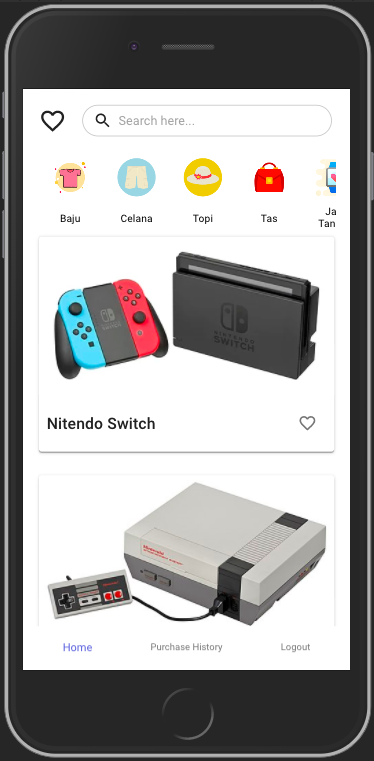

### My Commerce

**Follow the steps below:**
1. You can clone this project (use HTTPS) and run `git clone https://github.com/dodimoop/mycommerce.git` on your terminal
2. Move to inside project folder `cd mycommerce`
3. Install all dependencies, and run `yarn` on your terminal
4. Run `yarn start` on your terminal and then open [http://localhost:3000](http://localhost:3000) to view it in the browser.

### More
- Product filters do not use the new page but instead change directly to the product list
- Add Wishlist Feature
- Add Logout Feature
- I tried to use now.sh but they don't support Google Login and Facebook Login (this is the link mycommerce.now.sh)

- Thank you :)
